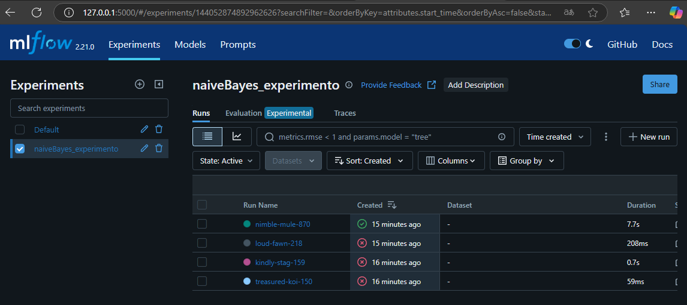

# Fluxo do Projeto

- Construindo Modelo de Machine Learning
- Registrar Logs no MLFLOW
- Registrando varios modelos no MLFLOW
- Registrando hiperparametros no MLFLOW
- Utilizando Servico de Predict MLFLOW utilzaindo o serivo ce deploy


### rodar o mlflow
```
    mlflow ui
```



### Consumir os modelos salvos no MLFLOW para fazer as predições

- Acessamos o MLFLOW e selecionamos o modelo com melhor acuracia
- Em Artifacts no lado direito tem informacoes em como consumir o modelo para fazer predicoes
- Criamos um novo jupyter notebook
